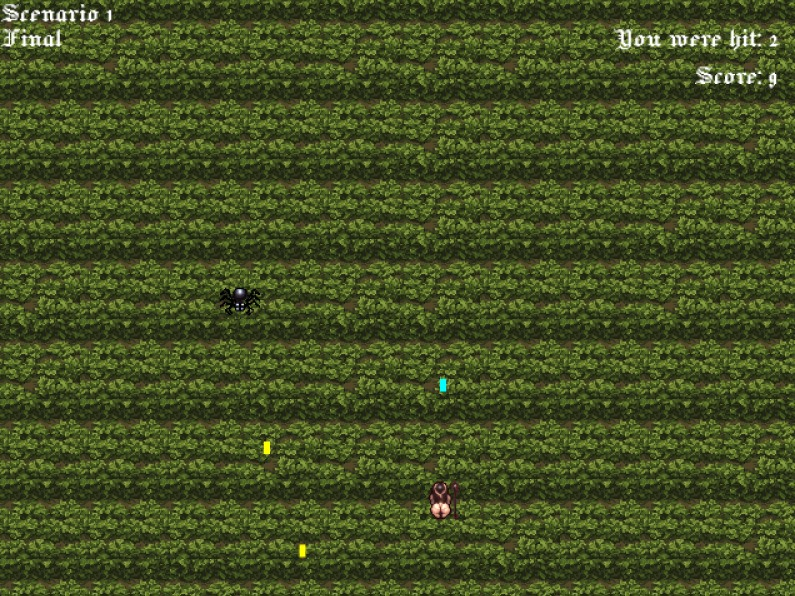

# S-Lav-O Ebiten based shooter (WIP)

## Overview

This repository contains the source code for a simple shooter game implemented in Golang using the Ebitengine game engine. Ebitengine is a simple and efficient game library for Go that makes game development straightforward. For more information, visit the [Ebitengine website](https://ebitengine.org).

## Features



- Simple and engaging gameplay
- Powered by the Ebitengine game engine
- Sprite-based graphics

## Getting Started

### Prerequisites

To run this game, you need to have Go installed on your machine. You can download it from the [official Go website](https://golang.org/dl/).

### Installation

1. Clone the repository:

    ```sh
    git clone https://github.com/Akaiko1/s-lav-o-game
    cd shooter-game
    ```

2. Install the dependencies:

    ```sh
    go mod tidy
    ```

### Running the Game

To run the game, execute the following command in your terminal:

```sh
go run main.go
```

## Project Structure

- `main.go`: The main entry point of the game.
- `game/`: Contains game logic and entities implemented using Ebitengine.
- `sprites/`: Directory containing sprite images used in the game.

## Contributing

Contributions are welcome! Please open an issue or submit a pull request if you have any improvements or bug fixes.

## License

This project is licensed under the MIT License. See the [LICENSE](LICENSE) file for details.
